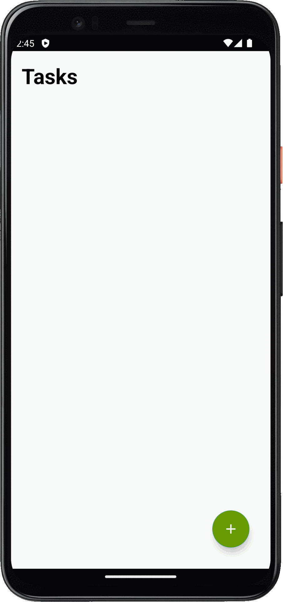
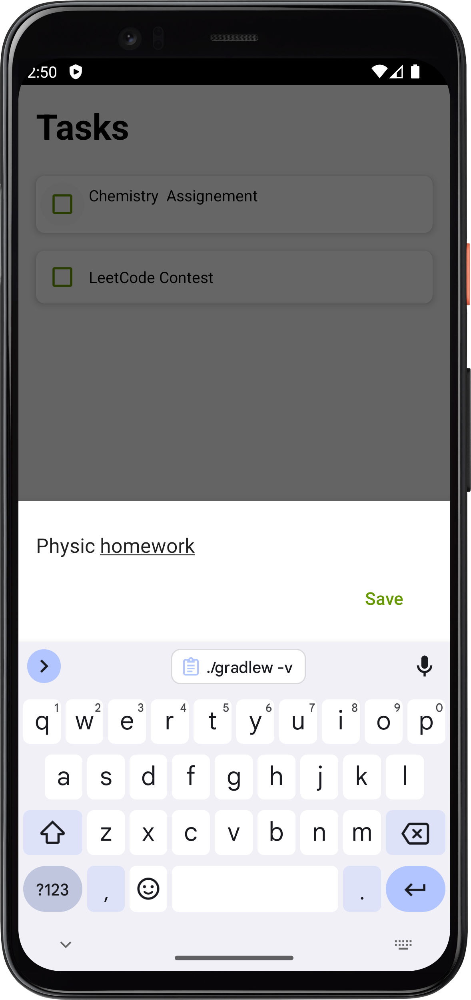

# To-Do-App

Welcome to the ToDo Android App repository! This simple and intuitive app is designed to help you organize your tasks and manage your daily activities efficiently. Whether you're a student, professional, or anyone with a busy schedule, this app is here to streamline your task management process.

## Features

- Home Screen: Display a list of tasks with titles.

- Task Creation: Allow users to add new tasks.

- Task Editing: Provide the ability to edit task titles by swapping to right.

- Task Deletion: Provide the ability to edit task titles by swapping to left.

- User Interface: Design an intuitive and user-friendly inter

## Demo

## Screenshots

## Contributing

Contributions are welcome! If you'd like to contribute to this project, please follow these steps:

1. Fork the repository.
2. Create a new branch (`git checkout -b feature/improvement`).
3. Make your changes.
4. Commit your changes (`git commit -am 'Add new feature'`).
5. Push to the branch (`git push origin feature/improvement`).
6. Create a new Pull Request.

